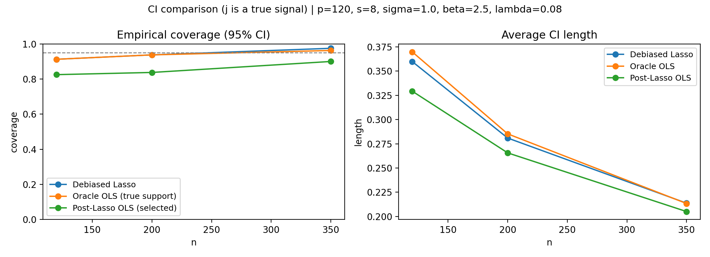
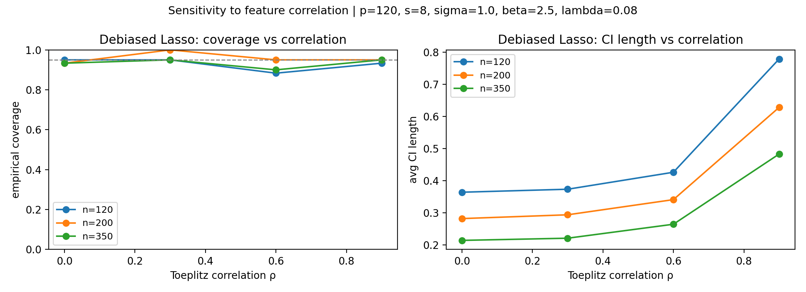

# HighDim-Inference-Toolkit

[](#installation)
[](https://github.com/leoplasture/HighDim-Inference-Toolkit/actions/workflows/tests.yml)
[](LICENSE)

HighDim-Inference-Toolkit is a research-friendly Python package for **high-dimensional linear regression** and **statistical inference**. It includes practical implementations of **Lasso**, **Debiased Lasso** (for inference and confidence intervals), and **Trans-Lasso** (for transfer learning).

## At a glance (for a quick evaluation)

**What you can learn from this repo**

- Statistical modeling: sparse high-dimensional linear regression (Lasso) and post-selection inference issues.
- High-dimensional inference: Debiased Lasso with nodewise Lasso for standard errors and Wald-type confidence intervals.
- Transfer learning: Trans-Lasso two-step estimator for leveraging auxiliary datasets.
- Research engineering: reproducible simulations → figures, unit tests, CI workflow, clean package namespace.

**Key results shown on this page**

- CI baseline comparison: post-selection OLS can mis-calibrate CIs; Debiased Lasso is designed to address bias from selection.
- Correlated design sweep: increasing feature correlation (Toeplitz $\rho$) changes empirical coverage and CI length.

## Installation

### Option A: Install from source (recommended for development)

```bash
pip install -r requirements.txt
pip install -e .
```

### Option B: Minimal install

```bash
pip install .
```

## Reproducibility

60-second checklist:

```bash
# 1) Install
pip install -r requirements.txt
pip install -e .

# 2) Run tests
python -m pytest -q

# 3) Reproduce figures used in this README
python scripts/make_coverage_comparison_figure.py
python scripts/make_correlation_sweep_figure.py
```

## Quick Start

```python
from highdim_inference_toolkit.debiased_lasso import DebiasedLasso
from highdim_inference_toolkit.lasso import LassoCD
from highdim_inference_toolkit.utils import generate_high_dim_data

X, y, _beta_true = generate_high_dim_data(n=200, p=500, s=10, beta_strength=2.0, seed=0)

lasso = LassoCD().fit(X, y, lambda_param=0.1)
db = DebiasedLasso(lambda_param=0.1, lambda_debias=0.1).fit(X, y)
print("CI for beta[0]:", db.confidence_interval(j=0, alpha=0.05))
```

See the tutorial notebook at [examples/tutorial.ipynb](examples/tutorial.ipynb).

For a minimal transfer-learning demo, run [examples/trans_lasso_quickstart.py](examples/trans_lasso_quickstart.py).

## API Reference

- `highdim_inference_toolkit.lasso.LassoCD`: Coordinate descent Lasso (from scratch, NumPy-only).
- `highdim_inference_toolkit.debiased_lasso.DebiasedLasso`: Debiased Lasso inference (debiased estimates, Wald CIs, z-tests).
- `highdim_inference_toolkit.trans_lasso.TransLasso`: Two-step Trans-Lasso for transfer learning.
- `highdim_inference_toolkit.confidence_interval.HighDimCI`: CI helpers (Wald/normal approximation, bootstrap CI, simulation utilities).
- `highdim_inference_toolkit.utils`: Data generation, standardization, and evaluation metrics.

Note: the legacy `src/` package is kept for earlier experiments; the public API is `highdim_inference_toolkit/`.

## Project Structure

- `highdim_inference_toolkit/`: main package code (clean public API)
- `tests/`: unit tests (Lasso + Debiased Lasso inference + Trans-Lasso)
- `examples/`: tutorial notebook + runnable scripts
- `scripts/`: reproducible experiment runners (e.g., figure generation)
- `assets/`: generated figures embedded in the README

## Statistical Background (short)

- **Lasso**: sparse point estimation in high dimensions via $\ell_1$ regularization.
- **Debiased Lasso**: bias correction + asymptotic normality for coordinate-wise inference; internally uses nodewise Lasso to approximate the precision matrix column needed for standard errors.
- **Trans-Lasso**: two-step transfer learning for high-dimensional regression; pools auxiliary datasets to estimate a shared component, then estimates a sparse contrast on target data.

## What I’m emphasizing (why this is not “just code”)

- Inference focus: the repo includes simulation evidence about **coverage** and **interval length** rather than only point-estimation metrics.
- Failure modes: correlated designs (large $\rho$) are included explicitly to show sensitivity in high-dimensional inference.
- Reproducibility: scripts generate the exact figures embedded in the README.

## Empirical Demo (CI coverage)

This plot compares three confidence-interval baselines for a true signal coordinate $\beta_j$:

- **Debiased Lasso Wald CI** (high-dimensional inference)
- **Oracle OLS CI** on the *true support* (best-case reference)
- **Post-Lasso OLS CI** on the *selected* support (illustrates selection effects)

- Run: `python scripts/make_coverage_comparison_figure.py`
- Output: [assets/ci_coverage_comparison.png](assets/ci_coverage_comparison.png)

Suggested reading of the plot:

- Oracle OLS is a best-case reference (uses the true support, which is unavailable in practice).
- Post-Lasso OLS illustrates that “select then infer” can distort nominal coverage.
- Debiased Lasso aims to correct selection-induced bias under assumptions.



## Sensitivity Demo (correlated design)

High-dimensional inference is sensitive to design correlation. This Monte Carlo sweep uses a Toeplitz covariance with correlation parameter $\rho$.

- Run: `python scripts/make_correlation_sweep_figure.py`
- Output: [assets/ci_coverage_vs_correlation.png](assets/ci_coverage_vs_correlation.png)

Suggested reading of the plot:

- As $\rho$ increases, the problem becomes harder: signals are less identifiable and nodewise regressions become less stable.
- Changes in both coverage and length highlight the trade-off between uncertainty quantification and design difficulty.



## Citation

GitHub will also detect [CITATION.cff](CITATION.cff) for software citation metadata.

If you use this toolkit in academic work, please cite the foundational papers:

```bibtex
@article{zhang2014confidence,
	title={Confidence intervals for low-dimensional parameters in high-dimensional linear models},
	author={Zhang, Cun-Hui and Zhang, Stephanie S},
	journal={Journal of the Royal Statistical Society: Series B (Statistical Methodology)},
	year={2014}
}

@article{li2020transfer,
	title={Transfer Learning for High-dimensional Linear Regression: Prediction, Estimation and Inference},
	author={Li, Wenxin and Cai, Tianxi and Li, Hongzhe},
	journal={Journal of the American Statistical Association},
	year={2020}
}
```

## Contributing

See [CONTRIBUTING.md](CONTRIBUTING.md).
